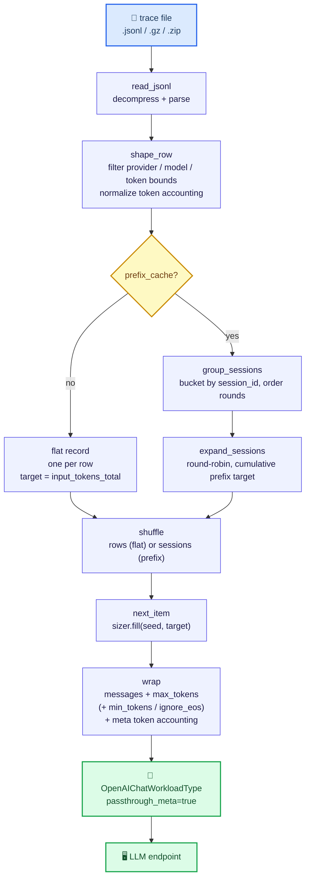

# Benchmarking an LLM endpoint with the TraceLab coding-agent trace

[TraceLab](https://github.com/uw-syfi/TraceLab) is a public, sanitized dataset
of **real coding-agent (Claude Code / Codex) LLM rounds** — 357K invocations
from 43 developers. It is, in effect, a workload *characterization* of coding
agents for LLM serving: every row records a round's full token accounting,
session structure, and timing.

Each row looks like:

```json
{
  "provider": "claude", "model": "claude-opus-4-8",
  "session_id": "claude:…", "round_index": 0, "round_id": "msg_…",
  "input_tokens_total": 32272, "prefix_tokens": 27217,
  "newly_append_tokens": 5055, "output_tokens": 931,
  "claude_cache_read_input_tokens": 27217, "tools": […], "timing_events": […]
}
```

The dataset is **sanitized for privacy**: prompt text, tool inputs, and paths
are stripped. What remains is the *shape* of a coding-agent load — exactly what
an LLM-serving benchmark needs. `benchmaker`'s `TraceLabWorkload` synthesizes
**token-faithful prompts** from that shape: each request's prompt is sized to
the round's recorded `input_tokens_total`, and `max_tokens` is set to its
recorded `output_tokens`.

Two replay modes reproduce different serving properties:

| Mode           | What it reproduces                                                       |
| -------------- | ------------------------------------------------------------------------ |
| **flat**       | The marginal prefill/decode token distribution (a throughput/latency sweep). Each request is independent. |
| **prefix-cache** | The conditional prefix-cache locality of a real coding agent. Rounds are grouped by `session_id`; within a session each round's prompt is a **byte-exact prefix** of the next, so the server's prefix cache is exercised the way it is in the wild. |

This page is a self-contained walkthrough — get the data, run a benchmark,
read the cache-hit metrics. For the moving parts it glosses over, see
[Workloads](workloads.md), [Load models](load-models.md), and
[Metrics & output](metrics.md).

---

## 1. Install

```bash
pip install -e .               # library + `benchmaker` CLI
pip install -e .[tokenizer]    # optional: exact token-count prompt sizing
```

## 2. Get the dataset

The sanitized trace ships as a GitHub release asset (~tens of MB compressed).
`tools/tracelab/prepare.py` downloads it, verifies the SHA256, and decompresses
it into `.local/` (gitignored):

```bash
python tools/tracelab/prepare.py
# .local/syfi_coding_trace.jsonl      (357,161 rows)
```

Carve a focused slice for fast iteration with the same filters the workload
accepts:

```bash
# Just Claude rows, 4K–32K input tokens, capped at 10K rounds
python tools/tracelab/prepare.py --provider claude \
    --min-input-tokens 4096 --max-input-tokens 32768 --max-items 10000
```

The workload also reads `.jsonl.gz` and `.zip` directly, so you can skip the
depress step if you prefer.

## 3. Run it — CLI

The `tracelab` recipe is an OpenAI-compatible chat benchmark pointed at the
trace. Point it at a local vLLM/SGLang/TGI server:

```bash
# flat: reproduce the coding-agent token distribution
benchmaker tracelab \
    --trace .local/syfi_coding_trace.jsonl \
    --url http://localhost:8000/v1/chat/completions \
    --model meta-llama/Llama-3.1-70B-Instruct \
    --max-items 5000 \
    --rate poisson:8 --duration 60s \
    --out-dir ./runs --label mode=flat
```

```bash
# prefix-cache: replay sessions with growing shared prefixes
benchmaker tracelab \
    --trace .local/syfi_coding_trace.jsonl \
    --url http://localhost:8000/v1/chat/completions \
    --model meta-llama/Llama-3.1-70B-Instruct \
    --prefix-cache --max-sessions 200 \
    --rate poisson:8 --duration 60s \
    --out-dir ./runs --label mode=prefix-cache
```

### Useful flags

| Flag | Purpose |
| ---- | ------- |
| `--prefix-cache` / `--flat` | Replay sessions with byte-exact growing prefixes (exercises the server's prefix cache), or independent flat requests. |
| `--match-output-tokens` | Force the server to decode exactly the recorded `output_tokens` (sets `min_tokens` + `ignore_eos`). Reproduces the true decode-length load; best on vLLM/SGLang. |
| `--max-tokens-cap N` | Clamp the per-request `max_tokens` so a few pathologically long rounds don't dominate. |
| `--provider {claude,codex}` / `--model-filter NAME` | Keep only rows recorded under that provider/model. |
| `--min/max-input-tokens`, `--min/max-output-tokens` | Inclusive token-range filters. |
| `--max-items N` / `--max-sessions N` | Cap the rows / sessions replayed. |
| `--chars-per-token F` | Char-mode token-size approximation (default `4.0`). The server's reported `prompt_tokens` is always the authoritative realized count. |
| `--tokenizer HF_ID` | Switch to exact token-count prompt sizing (needs `[tokenizer]`). |
| `--no-loop` | Stop when the filtered trace is exhausted instead of cycling it. |

> **`--model` vs `--model-filter`.** `--model` is the target model *under test*
> (sent in every request body). `--model-filter` keeps only trace rows that
> were originally recorded under a given model — useful for replaying, say,
> only the opus-4 workloads.

## 4. Run it — Python

```python
import asyncio
from benchmaker import (
    BenchConfig, BenchRunner, OpenAIChatWorkloadType, TraceLabWorkload,
    parse_rate_spec,
)

async def main():
    wt = OpenAIChatWorkloadType(
        url="http://localhost:8000/v1/chat/completions",
        model="meta-llama/Llama-3.1-70B-Instruct",
        passthrough_meta=True,          # record trace metadata, don't send it
        timeout_s=600,
    )
    workload = TraceLabWorkload(
        ".local/syfi_coding_trace.jsonl",
        prefix_cache=True,              # byte-exact growing session prefixes
        match_output_tokens=True,       # force the recorded decode length
        max_tokens_cap=1024,
        provider="claude",
        max_sessions=500,
        chars_per_token=4.0,
    )
    cfg = BenchConfig(
        workload_type=wt,
        workload=workload,
        load=parse_rate_spec("poisson:8", duration_s=60),
        timeout_s=600,
    )
    result = await BenchRunner(cfg).run()
    print(result.summary)

asyncio.run(main())
```

YAML works the same way:

```yaml
workload_type:
  type: openai-chat
  url: http://localhost:8000/v1/chat/completions
  model: meta-llama/Llama-3.1-70B-Instruct
  passthrough_meta: true
workload:
  type: tracelab
  path: .local/syfi_coding_trace.jsonl
  prefix_cache: true
  match_output_tokens: true
  max_tokens_cap: 1024
  provider: claude
  max_sessions: 500
load: poisson:8
duration: 60s
timeout_s: 600
```

## 5. What the metrics tell you

Because the dataset records the *intended* token accounting and the server
reports the *realized* one, each sample carries both — so you can measure
serving behavior directly:

| `Sample.extra`        | Source                  | Meaning |
| --------------------- | ----------------------- | ------- |
| `prompt_tokens_hint`  | trace `input_tokens_total` | target input size (the load you asked for) |
| `prefix_tokens_hint`  | trace `prefix_tokens`      | target cacheable prefix (prefix-cache mode only) |
| `prompt_tokens`       | server `usage`            | realized input tokens |
| `cached_tokens`       | server `usage` (vLLM/SGLang) | realized prefix-cache hit |
| `tokens_out`          | server `usage`            | realized completion length |
| `ttft_s`, `itl_ms_*`, `tokens_per_s` | streaming chunks | latency / decode-rate |

The headline prefix-cache question — *"does the server actually cache the
growing session prefix?"* — is `cached_tokens` vs `prefix_tokens_hint`. Compute
the realized hit ratio per request from `samples.jsonl`:

```python
from benchmaker import read_bundle, iter_jsonl

bundle = read_bundle("./runs/<run_id>")
for row in iter_jsonl(bundle["samples_path"]):
    target = row["meta"].get("prefix_tokens_hint")
    hit = row["extra"].get("cached_tokens")
    if target and hit is not None:
        ratio = hit / target
        ...
```

`benchmaker collect` aggregates `prompt_tokens_hint` and `prefix_tokens_hint`
just like any other workload metric, so a sweep over `--max-sessions` or
concurrency is one table:

```bash
benchmaker collect ./runs \
    --label mode \
    --metric workload_metrics.prompt_tokens_hint.mean \
    --metric workload_metrics.cached_tokens.mean \
    --metric workload_metrics.ttft_s.p99
```

## 6. How the workload works

`TraceLabWorkload` is a `Workload` (a data *source*): it turns trace rows into
per-request items and is paired with `OpenAIChatWorkloadType(passthrough_meta=true)`,
which turns each item into an OpenAI chat request and records the trace metadata
onto each sample. The whole path — from the on-disk trace to a request on the
wire — is a fixed pipeline. The filtered rows and the emission plan are
materialized **once** at construction (so sessions can be grouped for
prefix-cache mode); at run time `next_item()` just advances a cursor and
synthesizes the prompt.



The trace has no prompt text, so the workload reconstructs each request's
*size* and *prefix structure*:

- **Token sizing.** In char mode (default), `target_chars = round(target_tokens
  × chars_per_token)` and the prompt is a deterministic filler string sliced to
  that length. In tokenizer mode (`--tokenizer <id>`), the workload finds a
  single-token filler unit and repeats it `target_tokens` times, giving exact
  counts (when the server's tokenizer matches). Either way the server's own
  `prompt_tokens` is authoritative.
- **Prefix nesting (prefix-cache mode).** Within a session the workload builds
  one growing filler stream and slices it per round, so round *i*'s prompt is a
  byte-exact prefix of round *i+1*'s — the condition a server's prefix cache
  matches on. The shared base prefix is seeded to the first round's recorded
  `prefix_tokens` (the system prompt + initial context), then each round
  appends its `newly_append_tokens`. The server can serve the shared left
  portion from cache and only prefill the freshly appended tail:

  ```mermaid
  flowchart TB
      accTitle: Byte-exact prefix nesting within a session
      accDescr: In prefix-cache mode a session's rounds share one growing filler stream, so round i's synthesized prompt is a byte-exact prefix of round i+1's; only the freshly appended tail per round is new, and the shared prefix is a prefix-cache hit.

      r0["round 0  =  base_prefix"]
      r1["round 1  =  base_prefix + newly_1"]
      r2["round 2  =  base_prefix + newly_1 + newly_2"]
      r0 --> r1 --> r2

      classDef nest fill:#dbeafe,stroke:#2563eb,stroke-width:1px,color:#1e3a5f
      class r0,r1,r2 nest
  ```

- **Session ordering.** Rounds are emitted round-robin across sessions (round 0
  of every session, then round 1, …) so a session's consecutive rounds land
  close together in the stream — the pattern an LLM server sees from many
  concurrent agents — while still mixing sessions. `--no-shuffle` keeps the
  file's session order; default shuffles session order (rounds within a session
  always stay ordered).

The synthesized text is intentionally generic (it has to be — the real content
is gone). What it reproduces faithfully is the **distribution of prompt sizes,
decode lengths, and prefix-locality** — the workload properties that determine
serving throughput, TTFT, and cache efficiency.

## 7. Caveats

- **No real content.** Correctness/quality metrics are meaningless here (the
  server's output is judged only as a serving load, not as an answer). Use this
  workload for latency/throughput/cache studies, not for eval.
- **Decode length may be short.** Without `--match-output-tokens`, the model
  stops early on generic filler, so `tokens_out` under-reports the trace's
  decode load. Add `--match-output-tokens` (vLLM/SGLang) to force the recorded
  length.
- **`chars_per_token` is an approximation.** Code-heavy traces tokenize denser
  than `4.0`; recalibrate against a run's realized `prompt_tokens` if exact
  input sizing matters, or use `--tokenizer`.
- **Memory.** The filtered rows are materialized at construction (so sessions
  can be grouped for prefix-cache mode). For the full 357K-row trace this is
  tens of MB; use `--max-items` / `--max-sessions` or pre-subset with
  `prepare.py` to bound it.

## Citation

If you use this workload, cite the TraceLab dataset:

```bibtex
@misc{zhu2026tracelabcharacterizingcodingagent,
  title={TraceLab: Characterizing Coding Agent Workloads for LLM Serving},
  author={Kan Zhu and Mathew Jacob and Chenxi Ma and Yi Pan and
          Stephanie Wang and Arvind Krishnamurthy and Baris Kasikci},
  year={2026}, eprint={2606.30560}, archivePrefix={arXiv},
  primaryClass={cs.LG}, url={https://arxiv.org/abs/2606.30560},
}
```
